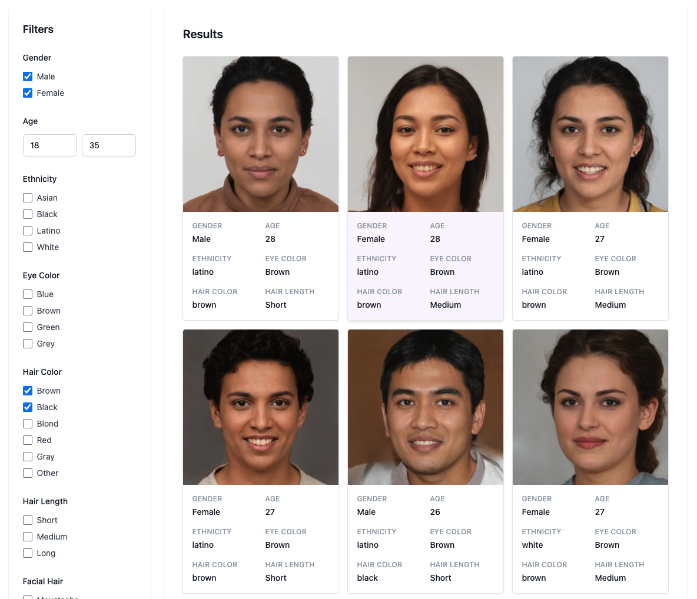
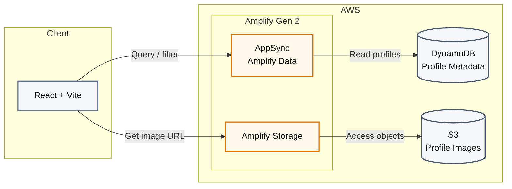

# AWS Amplify Gen 2 Gallery

A demo gallery built with **React, Vite, AWS Amplify Gen 2, Amazon S3, and Amazon DynamoDB**.

The application demonstrates how to build a searchable image-based application using AWS-managed infrastructure, with profile metadata stored in DynamoDB and images stored in S3.

> **Prototype:** Quick demo. Not production-ready; additional testing, fixes, and polish are needed.

## Demo

**Live Demo:** https://main.djeq8r5lttae6.amplifyapp.com/

Browse and filter a collection of generated profiles by attributes such as:

- Gender
- Age
- Ethnicity
- Eye color
- Hair color
- Hair length
- Facial hair
- Appearance

Each profile displays its generated photo along with the associated attributes.

> **⚠️ All people shown are AI-generated**



## Tech Stack

- **React** — UI
- **Vite** — Frontend tooling
- **Tailwind CSS** — Styling
- **AWS Amplify Gen 2** — Backend and deployment
- **Amazon DynamoDB** — Profile metadata
- **Amazon S3** — Profile images
- **AWS AppSync / Amplify Data** — Data access
- **TypeScript** — Type safety

## Architecture



The frontend queries profile metadata through AppSync and Amplify Data, while profile images are stored in S3 and accessed through Amplify Storage.

## AWS Amplify

The project uses **Amplify Gen 2** to define and deploy the backend infrastructure.

The `Profile` model contains attributes including:

```text
image
gender
age
ethnicity
hairColor
hairLength
bald
eyeColor
smile
eyeMakeup
lipMakeup
happiness
sadness
anger
surprise
neutral
moustache
beard
sideburns
bugProbability
```

The application uses Amplify's generated data client to query profile data through the Amplify-managed API.

## Dataset

The profile images and associated attributes are based on the **Academic Dataset by Generated Photos**.

The dataset contains synthetically generated people rather than photographs of real individuals and is used here for demonstration purposes.

**Dataset:** [Generated Photos Academic Dataset on Kaggle](https://www.kaggle.com/datasets/generatedphotos/generated-photos-academic-dataset?utm_source=chatgpt.com)

Please refer to the dataset provider's terms and licensing information before using the dataset or its contents in another project.

## Purpose

This project was created as a practical demonstration of building a modern AWS-backed web application.

It focuses on:

- React component architecture
- TypeScript
- AWS Amplify Gen 2
- DynamoDB data modeling
- S3 object storage
- Querying and filtering data
- Pagination
- Cloud deployment
- Separating frontend components from backend/data logic

## Running Locally

1. Download the dataset from [Kaggle — Generated Photos Academic Dataset](https://www.kaggle.com/datasets/generatedphotos/generated-photos-academic-dataset?utm_source=chatgpt.com) and migrate the profile data and images into your DynamoDB and S3 resources.

2. Install dependencies:

```bash
npm install
```

3. Start the Vite development server:

```bash
npm run dev
```

4. For local Amplify backend development, use the Amplify sandbox environment:

```bash
npx ampx sandbox
```

## Deployment

The project can be deployed using **AWS Amplify Hosting**.

Amplify builds the Vite application and deploys the associated backend resources defined in the project.

The production environment has its own AWS resources, separate from an individual local Amplify sandbox.

## Disclaimer

This is a technical demonstration project. The people shown in the application are AI-generated and are not intended to represent real individuals.

## Author

Jorge Donoso
